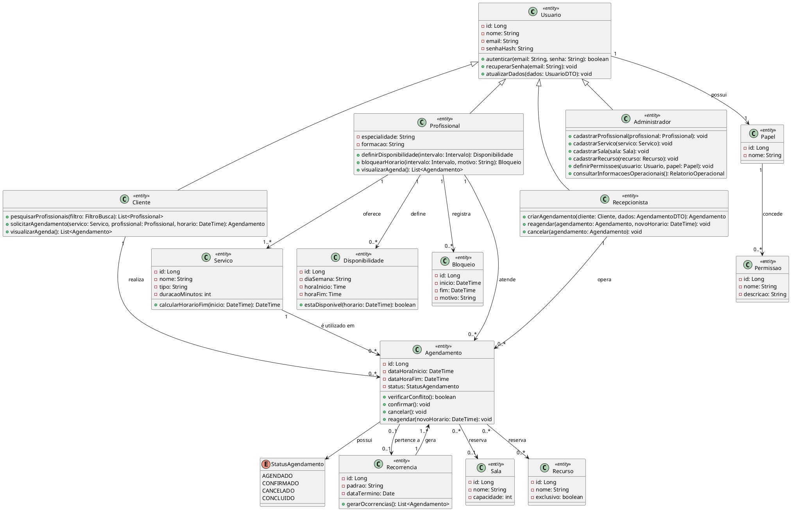

## Introdução

O Diagrama de Classes é uma representação visual das classes, seus atributos, métodos e os relacionamentos entre elas. Ele é fundamental para a modelagem orientada a objetos e serve como base para a implementação do sistema de agendamento multidisciplinar.

## Objetivo

Este documento define, para o projeto real, um modelo que evolui do Diagrama de Classes Conceitual (visão de domínio) para o Diagrama de Classes de Especificação (visão de projeto), ambos derivados dos casos de uso, do diagrama de casos de uso, do levantamento de requisitos e do protótipo de baixa fidelidade já produzidos.

## Fontes de entrada obrigatórias

- [Levantamento de requisitos](./levreq.md#2-requisitos-funcionais) e [requisitos não funcionais](./levreq.md#3-requisitos-nao-funcionais).
- [Casos de uso](./casos_de_uso.md): atores, fluxos principal e alternativos (UC01 a UC05).
- Diagrama de casos de uso: escopo e fronteiras do sistema (seção 5 de [Casos de uso](./casos_de_uso.md)).
- [Protótipo de baixa fidelidade](./prototipos_baixa_fidelidade_md/index.md): entidades percebidas na interface e regras de navegação.
- [Regras de negócio](./regras-de-negocio.md): restrições que os relacionamentos e atributos precisam respeitar.

## 1) Diagrama de Classes Conceitual

### 1.1 Finalidade

Representar os conceitos do domínio de agendamento multidisciplinar, suas responsabilidades e relacionamentos, sem detalhes de implementação.

### 1.2 Escopo

- Entidades de negócio: usuários (nas suas quatro especializações), serviços, disponibilidade, bloqueios, agendamentos, recorrência, salas e recursos.
- Objetos de valor: papel de acesso e permissão.
- Regras de associação e cardinalidade entre essas entidades.
- Generalização de `Usuario` para `Cliente`, `Profissional`, `Recepcionista` e `Administrador`.

### 1.3 Classes conceituais

**Usuario**
- Descrição: qualquer pessoa que acessa a plataforma, autenticada por e-mail e senha.
- Atributos de domínio: nome, e-mail, senha, papel de acesso.
- Relacionamentos: um Usuario possui 1 Papel.
- Restrições de negócio: RN08, RN09, RF19 — o papel do usuário determina o que ele pode visualizar ou alterar.

**Cliente** (especialização de Usuario)
- Descrição: pessoa que pesquisa profissionais e realiza agendamentos.
- Atributos de domínio: histórico de atendimentos.
- Relacionamentos: um Cliente realiza 0 a N Agendamentos.
- Restrições de negócio: RN02 — um cliente não pode ter dois atendimentos simultâneos.

**Profissional** (especialização de Usuario)
- Descrição: personal trainer, nutricionista, fisioterapeuta ou outro profissional que oferece serviços.
- Atributos de domínio: especialidade, formação/apresentação.
- Relacionamentos: um Profissional oferece 1 a N Serviços; define 0 a N Disponibilidades; registra 0 a N Bloqueios; atende 0 a N Agendamentos.
- Restrições de negócio: RN01 — um profissional não pode ter dois atendimentos simultâneos; RN13 — bloqueios tornam o intervalo indisponível.

**Recepcionista** (especialização de Usuario)
- Descrição: opera a agenda em nome de clientes e profissionais dentro das permissões do seu papel.
- Relacionamentos: uma Recepcionista opera 0 a N Agendamentos.
- Restrições de negócio: RN14 — a recepção só executa operações permitidas ao seu papel.

**Administrador** (especialização de Usuario)
- Descrição: gerencia cadastros e a estrutura operacional da organização.
- Relacionamentos: um Administrador gerencia 0 a N Serviços, Salas, Recursos e define Papéis de outros usuários.
- Restrições de negócio: RN09 — possui permissão de gestão conforme política definida.

**Servico**
- Descrição: atendimento oferecido por um profissional (ex.: avaliação física, consulta nutricional).
- Atributos de domínio: nome, tipo, duração.
- Relacionamentos: um Servico está associado a 1 Profissional; é utilizado em 0 a N Agendamentos.
- Restrições de negócio: RN07 — a duração do agendamento deve considerar a duração do serviço.

**Disponibilidade**
- Descrição: janela de horário em que um profissional pode ser agendado.
- Atributos de domínio: dia da semana, horário de início, horário de fim.
- Relacionamentos: uma Disponibilidade pertence a 1 Profissional.
- Restrições de negócio: RN05 — apenas horários compatíveis com a disponibilidade podem ser selecionados.

**Bloqueio**
- Descrição: período em que o profissional torna-se indisponível.
- Atributos de domínio: início, fim, motivo.
- Relacionamentos: um Bloqueio pertence a 1 Profissional.
- Restrições de negócio: RN13.

**Agendamento**
- Descrição: reserva de um serviço, em um horário, entre cliente e profissional, podendo envolver sala e/ou recurso.
- Atributos de domínio: data/horário, status do atendimento.
- Relacionamentos: um Agendamento envolve 1 Cliente, 1 Profissional e 1 Servico; pode reservar 0 a 1 Sala e 0 a N Recursos; pode pertencer a 0 ou 1 Recorrencia.
- Restrições de negócio: RN01, RN02, RN03, RN04, RN06, RN10.

**Recorrencia**
- Descrição: padrão de repetição de um agendamento (ex.: semanalmente).
- Atributos de domínio: padrão de repetição, data de término.
- Relacionamentos: uma Recorrencia gera 1 a N Agendamentos (ocorrências).
- Restrições de negócio: RN11 — cada ocorrência é validada individualmente; RN12 — uma ocorrência com conflito não pode sobrescrever outra reserva.

**Sala**
- Descrição: espaço físico compartilhado (consultório, estúdio) usado em atendimentos.
- Atributos de domínio: nome, capacidade.
- Relacionamentos: uma Sala é reservada em 0 a N Agendamentos.
- Restrições de negócio: RN03 — não pode ser reservada por dois atendimentos no mesmo intervalo.

**Recurso**
- Descrição: equipamento ou item exclusivo necessário a determinados serviços.
- Atributos de domínio: nome, se é exclusivo ou compartilhado.
- Relacionamentos: um Recurso é reservado em 0 a N Agendamentos.
- Restrições de negócio: RN04 — um recurso exclusivo não pode ser reservado simultaneamente.

**Papel** e **Permissao**
- Descrição: definem o que cada tipo de usuário pode fazer no sistema.
- Relacionamentos: um Papel concede 0 a N Permissões; um Usuario possui 1 Papel.
- Restrições de negócio: RN08, RN09, RF19.

### 1.4 Rastreabilidade

| Classe Conceitual | Requisito(s) | Caso(s) de Uso | Tela/Protótipo |
|---|---|---|---|
| Usuario | RF01, RF02, RF03 | UC01 | Login, Cadastro |
| Cliente | RF08, RF09, RF10, RF11, RF12, RF17 | UC02, UC04 | Home do Cliente, Buscar Profissionais, Minha Agenda |
| Profissional | RF04, RF07, RF18, RF20 | UC03 | Perfil do Profissional, Painel do Profissional |
| Recepcionista | RF25 | UC04 | Painel de Administração (operação) |
| Administrador | RF04, RF05, RF06, RF19, RF23 | UC05 | Administração |
| Papel / Permissao | RF19 | UC05 | Administração |
| Servico | RF05, RF07 | UC02, UC05 | Perfil do Profissional, Novo Agendamento |
| Disponibilidade | RF07, RF09 | UC03 | Perfil do Profissional |
| Bloqueio | RF20 | UC03 | Painel do Profissional |
| Agendamento | RF10, RF13, RF14, RF15, RF24, RF26 | UC02, UC04 | Novo Agendamento, Conflito de Agendamento |
| Recorrencia | RF16 | UC02 | Novo Agendamento |
| Sala | RF06, RF15 | UC02, UC05 | Novo Agendamento, Administração |
| Recurso | RF06, RF15 | UC02, UC05 | Novo Agendamento, Administração |

### 1.5 Critérios de validação

- Cada classe deve ter vínculo com ao menos um requisito/caso de uso — atendido na tabela acima.
- Não incluir classes técnicas (ex.: repositório, controller) — respeitado; classes técnicas só aparecem na especificação, quando necessário.
- Terminologia alinhada ao domínio do problema (cliente, profissional, serviço, agendamento, sala, recurso), conforme pesquisa e documento de visão.

## 2) Transição para Diagrama de Classes de Especificação

### 2.1 Objetivo

Refinar o modelo conceitual acima para uma estrutura orientada à implementação, mantendo rastreabilidade com requisitos e casos de uso.

### 2.2 Regras de refinamento

- Converter conceitos em classes de software quando aplicável (todas as classes conceituais tornam-se entidades de domínio).
- Definir tipos de atributos e visibilidade (privados por padrão, com acesso via métodos).
- Incluir operações principais identificadas nos fluxos dos casos de uso (autenticar, pesquisar, agendar, validar conflito, cancelar, reagendar, gerar ocorrências).
- Aplicar estereótipos quando necessário (`<<entity>>` para as classes de domínio listadas).
- Preservar a rastreabilidade com requisitos e casos de uso já registrada na seção 1.4.

### 2.3 Itens esperados por classe

- Nome da classe.
- Atributos (nome: tipo [visibilidade]).
- Métodos/operações (assinatura).
- Responsabilidade.
- Dependências e associações.
- Restrições/invariantes (quando houver), referenciando as regras de negócio (RN01–RN15).

## 3) Diagrama de Classes de Especificação

### 3.1 Conteúdo mínimo

- Classes de domínio: `Usuario`, `Cliente`, `Profissional`, `Recepcionista`, `Administrador`, `Servico`, `Disponibilidade`, `Bloqueio`, `Agendamento`, `Recorrencia`, `Sala`, `Recurso`, `Papel`, `Permissao`.
- Enumeração de apoio: `StatusAgendamento`.
- Associações, generalizações e multiplicidades derivadas da seção 1.
- Operações alinhadas aos fluxos dos casos de uso UC01 a UC05.

### 3.2 Rastreabilidade

| Classe de Especificação | Origem Conceitual | Requisito(s) | Caso(s) de Uso |
|---|---|---|---|
| Usuario | Usuario | RF01, RF02, RF03 | UC01 |
| Cliente | Cliente | RF08, RF09, RF10, RF11, RF12 | UC02, UC04 |
| Profissional | Profissional | RF04, RF07, RF20 | UC03 |
| Recepcionista | Recepcionista | RF25 | UC04 |
| Administrador | Administrador | RF04, RF05, RF06, RF19, RF23 | UC05 |
| Papel / Permissao | Papel / Permissao | RF19 | UC05 |
| Servico | Servico | RF05 | UC02, UC05 |
| Disponibilidade | Disponibilidade | RF07, RF09 | UC03 |
| Bloqueio | Bloqueio | RF20 | UC03 |
| Agendamento | Agendamento | RF10, RF13, RF14, RF15, RF24, RF26 | UC02, UC04 |
| Recorrencia | Recorrencia | RF16 | UC02 |
| Sala | Sala | RF06, RF15 | UC02, UC05 |
| Recurso | Recurso | RF06, RF15 | UC02, UC05 |

### 3.3 Critérios de qualidade

- Cobertura dos requisitos funcionais: todos os RF de RF01 a RF26, exceto os de evolução (RF21, RF22), estão representados por ao menos uma classe ou operação.
- Coesão alta e acoplamento controlado: cada classe concentra atributos e comportamentos de um único conceito de domínio; a validação de conflito fica centralizada em `Agendamento.verificarConflito()`.
- Nomes consistentes com o domínio (Cliente, Profissional, Servico, Agendamento, Sala, Recurso), sem termos técnicos de infraestrutura.
- Ausência de classes sem responsabilidade clara: `Papel`/`Permissao` existem para sustentar RF19 e as regras RN08/RN09.

## 4) Estrutura de versionamento e revisão

| Versão | Data | Autor(es) | Revisor(es) | Resumo da alteração |
|---|---|---|---|---|
| v0.1 | 17/09/2026 | Equipe do projeto | — | Criação do diagrama de classes conceitual e de especificação a partir do roteiro e dos casos de uso |

## 5) Entregáveis

- Diagrama de Classes Conceitual (seção 1, fonte PlantUML a ser gerada a partir da lista de classes e relacionamentos descritos).
- Diagrama de Classes de Especificação (imagem + fonte na seção 3.1).
- Tabelas de rastreabilidade preenchidas (seções 1.4 e 3.2).
- Registro de validação com equipe e stakeholders, a ser conduzido junto com a seção 7 (Validação) de [Casos de uso](./casos_de_uso.md).

## Conclusão

O modelo conceitual e o modelo de especificação apresentados cobrem todas as entidades necessárias ao fluxo de agendamento multidisciplinar — usuários e seus papéis, serviços, disponibilidade, bloqueios, agendamentos, recorrência, salas e recursos — mantendo rastreabilidade direta com os requisitos funcionais e com os casos de uso descritos em [Casos de uso](./casos_de_uso.md). O diagrama de especificação está pronto para orientar a modelagem do banco de dados e a implementação incremental prevista na metodologia e no backlog.

## Referências

> [Casos de uso](./casos_de_uso.md)

> [Requisitos funcionais](./levreq.md#2-requisitos-funcionais)

> [Requisitos não funcionais](./levreq.md#3-requisitos-nao-funcionais)

> [Regras de negócio](./regras-de-negocio.md)

> [Protótipo de baixa fidelidade](./prototipos_baixa_fidelidade_md/index.md)

## Autor(es)

| Data | Versão | Descrição | Autor(es) |
|---|---|---|---|
| 17/09/2026 | 1.0 | Criação do diagrama de classes conceitual e de especificação a partir do roteiro | Equipe do projeto |