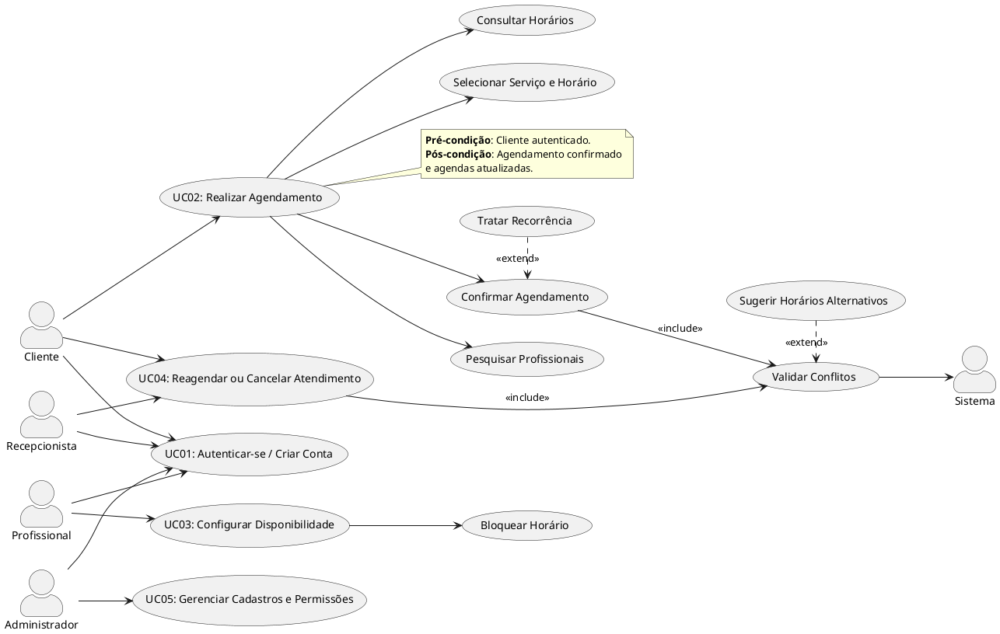
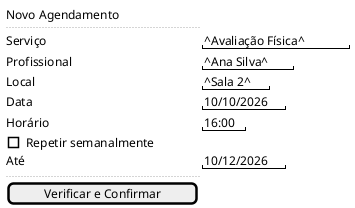

## Introdução

Este documento aplica ao projeto real — a Plataforma Web de Agendamento Multidisciplinar — o roteiro de elicitação e representação de casos de uso. Ele organiza os stakeholders, os requisitos funcionais e não funcionais já levantados, detalha os fluxos de uso mais relevantes, apresenta o diagrama de casos de uso em UML/PlantUML, referencia o protótipo de baixa fidelidade e define critérios de validação.

## Metodologia

O conteúdo foi derivado da <a href="../Iniciacao/pesquisa.md">pesquisa do tema</a>, do <a href="../Iniciacao/documento_de_visao.md">documento de visão</a>, dos <a href="#2-requisitos-funcionais">requisitos funcionais</a>, dos <a href="#3-requisitos-nao-funcionais">requisitos não funcionais</a>, das <a href="./regras-de-negocio.md">regras de negócio</a> e do <a href="./prototipos_baixa_fidelidade_md/index.md">protótipo de baixa fidelidade</a>, seguindo a estrutura de roteiro: stakeholders, requisitos, caso de uso detalhado, diagrama, protótipo e validação.

## 1. Identificação dos Stakeholders

- **Clientes:** pessoas que buscam agendar atendimentos com personal trainers, nutricionistas, fisioterapeutas e outros profissionais de saúde, treinamento e bem-estar.
- **Profissionais:** personal trainers, nutricionistas, fisioterapeutas e demais profissionais autorizados, que oferecem serviços, configuram disponibilidade e atendem clientes.
- **Recepcionistas:** usuários responsáveis pela operação da agenda em nome de clientes e profissionais dentro de academias, clínicas e estúdios.
- **Administradores:** gerenciam cadastros de profissionais, serviços, salas, recursos e permissões da organização.
- **Sistema (ator de apoio):** valida conflitos de horário, sala e recurso antes de confirmar qualquer operação de agenda.

## 2. Requisitos Funcionais

| ID | Descrição | Prioridade |
|---|---|---|
| RF01 | O sistema deve permitir cadastro de usuários. | Alta |
| RF02 | O sistema deve permitir autenticação por e-mail e senha. | Alta |
| RF03 | O sistema deve permitir recuperação de senha. | Alta |
| RF04 | O administrador deve cadastrar e gerenciar profissionais. | Alta |
| RF05 | O administrador deve cadastrar e gerenciar serviços. | Alta |
| RF06 | O administrador deve cadastrar salas e recursos. | Média |
| RF07 | O profissional deve configurar sua disponibilidade. | Alta |
| RF08 | O cliente deve pesquisar profissionais. | Alta |
| RF09 | O cliente deve visualizar horários disponíveis. | Alta |
| RF10 | O cliente deve realizar agendamentos. | Alta |
| RF11 | O cliente deve cancelar seus agendamentos permitidos. | Média |
| RF12 | O cliente deve reagendar seus atendimentos permitidos. | Média |
| RF13 | O sistema deve impedir conflito de horário do profissional. | Alta |
| RF14 | O sistema deve impedir conflito de horário do cliente. | Alta |
| RF15 | O sistema deve impedir conflito de sala ou recurso exclusivo. | Alta |
| RF16 | O sistema deve permitir agendamentos recorrentes. | Média |
| RF17 | O sistema deve exibir a agenda do cliente. | Alta |
| RF18 | O sistema deve exibir a agenda do profissional. | Alta |
| RF19 | O sistema deve controlar permissões conforme o papel do usuário. | Alta |
| RF20 | O profissional deve poder bloquear horários. | Média |
| RF21 | O sistema poderá enviar lembretes de atendimento (evolução do MVP). | Baixa |
| RF22 | O sistema poderá oferecer lista de espera (evolução do MVP). | Baixa |
| RF23 | O administrador deve consultar informações operacionais básicas. | Baixa |
| RF24 | O sistema deve registrar o status do atendimento. | Média |
| RF25 | A recepção deve poder criar, reagendar ou cancelar agendamentos dentro de suas permissões. | Média |
| RF26 | O sistema deve informar o motivo de um conflito e permitir nova seleção de horário. | Alta |

> Prioridades alinhadas ao [backlog do projeto](../Construcao/github_projects.md).

## 3. Requisitos Não Funcionais

**Desempenho e Integridade:** o banco de dados deve manter integridade entre usuários, profissionais, horários e recursos (RNF05); conflitos devem ser validados antes de confirmar qualquer agendamento (RNF06); operações críticas de agenda devem ser validadas no back-end, não apenas na interface (RNF13); datas e horários devem ser registrados de forma consistente para evitar divergências (RNF14).

**Segurança e Privacidade:** senhas não devem ser armazenadas em texto puro (RNF03); todo acesso deve respeitar autenticação e autorização (RNF04); dados pessoais e sensíveis devem ter acesso restrito aos perfis autorizados (RNF10); o sistema deve coletar somente os dados necessários ao escopo (RNF11); credenciais e segredos de infraestrutura não devem ser versionados em repositório público (RNF12).

**Usabilidade:** a interface deve ser responsiva para desktop, tablet e celular (RNF01); as páginas principais devem ter navegação simples e consistente (RNF02); erros devem apresentar mensagens compreensíveis ao usuário (RNF09).

**Manutenibilidade:** código e documentação devem ser versionados com Git (RNF07); a aplicação deve possuir organização modular para facilitar manutenção (RNF08).

## 4. Casos de Uso

### UC01 - Autenticar-se / Criar Conta

**Atores:** Cliente, Profissional, Recepcionista, Administrador, Sistema.

**Pré-condição:** Usuário possui um e-mail válido; se já cadastrado, conhece sua senha.

**Fluxo Principal:**
1. Usuário informa e-mail e senha na tela de login.
2. Sistema valida as credenciais.
3. Sistema redireciona o usuário para a área correspondente ao seu papel.

**Fluxos Alternativos:**
- FA1: Usuário sem conta → usuário seleciona "Criar conta", informa nome, e-mail, senha e perfil; sistema cria a conta associada a um papel (RF01, RF19).
- FA2: Senha esquecida → usuário seleciona "Esqueci minha senha"; sistema inicia fluxo de recuperação (RF03).
- FA3: Credenciais inválidas → sistema informa o erro de forma compreensível e permite nova tentativa (RNF09).

**Pós-condição:** Usuário autenticado e com acesso às funcionalidades permitidas ao seu papel.

### UC02 - Realizar Agendamento

**Atores:** Cliente, Sistema.

**Pré-condição:** Cliente autenticado.

**Fluxo Principal:**
1. Cliente pesquisa profissionais por especialidade, modalidade e local (RF08).
2. Cliente seleciona um profissional e consulta os serviços oferecidos.
3. Cliente consulta horários disponíveis compatíveis com a disponibilidade do profissional (RF09).
4. Cliente escolhe serviço, data e horário e confirma o pedido de agendamento (RF10).
5. Sistema valida conflito de horário do cliente, do profissional e de sala/recurso exclusivo (RF13, RF14, RF15).
6. Sistema confirma o agendamento e atualiza a agenda do cliente e do profissional (RF17, RF18).

**Fluxos Alternativos:**
- FA1: Conflito detectado → sistema informa o motivo do conflito e sugere horários alternativos (RF26).
- FA2: Cliente marca a opção de repetição semanal → sistema trata o pedido como recorrência e valida cada ocorrência individualmente, sem sobrescrever reservas existentes (RF16, RN11, RN12).

**Pós-condição:** Agendamento (ou série de ocorrências) confirmado e refletido nas agendas do cliente e do profissional; status do atendimento registrado (RF24).

### UC03 - Configurar Disponibilidade e Bloquear Horários

**Atores:** Profissional.

**Pré-condição:** Profissional autenticado.

**Fluxo Principal:**
1. Profissional acessa o painel de disponibilidade.
2. Profissional informa os horários em que está disponível para atendimento (RF07).
3. Profissional pode bloquear um período específico, informando o motivo (RF20).
4. Sistema atualiza a disponibilidade exibida aos clientes na busca (RF08, RF09).

**Fluxos Alternativos:**
- FA1: Bloqueio conflita com um agendamento já confirmado → sistema alerta o profissional antes de aplicar o bloqueio (RN13).

**Pós-condição:** Disponibilidade e bloqueios atualizados e considerados nas próximas buscas e validações de conflito.

### UC04 - Reagendar ou Cancelar Atendimento

**Atores:** Cliente, Recepcionista.

**Pré-condição:** Existe um atendimento previamente confirmado (RF11, RF12, RF25).

**Fluxo Principal:**
1. Ator seleciona o atendimento na agenda do cliente ou na agenda operada pela recepção.
2. Ator escolhe reagendar ou cancelar.
3. Em caso de cancelamento, sistema libera o horário, atualizando a disponibilidade (RN10).
4. Em caso de reagendamento, sistema solicita novo horário e repete a validação de conflitos (RF13, RF14, RF15).

**Fluxos Alternativos:**
- FA1: Novo horário em conflito → sistema recusa a alteração e sugere horários alternativos (RF26).
- FA2: Ação fora das permissões do papel do ator → sistema bloqueia a operação (RF19, RN14).

**Pós-condição:** Atendimento cancelado ou reagendado; agendas do cliente e do profissional atualizadas; status do atendimento refletido (RF24).

### UC05 - Gerenciar Cadastros e Permissões

**Atores:** Administrador.

**Pré-condição:** Administrador autenticado com permissão de gestão (RN09).

**Fluxo Principal:**
1. Administrador cadastra ou edita profissionais (RF04).
2. Administrador cadastra ou edita serviços, definindo nome, tipo e duração (RF05).
3. Administrador cadastra salas e recursos, incluindo recursos exclusivos (RF06).
4. Administrador define papéis e permissões de acesso dos usuários (RF19).
5. Administrador consulta informações operacionais básicas, como agendamentos do dia e ocupação de salas (RF23).

**Fluxos Alternativos:**
- FA1: Dados obrigatórios ausentes no cadastro → sistema impede o salvamento e indica os campos pendentes (RNF09).

**Pós-condição:** Cadastros de profissionais, serviços, salas, recursos e permissões atualizados e disponíveis para os demais casos de uso.

## 5. Diagrama de Casos de Uso

Diagrama de Caso de Uso (UML) representando os fluxos acima, em PlantUML:

**Explicação:**

- **Atores:** Cliente interage com busca, agendamento e sua própria agenda; Profissional configura disponibilidade e bloqueios; Recepcionista opera agendamentos em nome de terceiros; Administrador gerencia cadastros e permissões; Sistema é o ator de apoio que executa a validação de conflitos.
- **Relacionamentos `<<include>>`:** confirmar um agendamento sempre inclui a validação de conflitos, tanto quando originado pelo cliente (UC02) quanto pela recepção (UC04).
- **Relacionamentos `<<extend>>`:** os fluxos alternativos de conflito e de recorrência estendem o fluxo principal apenas quando aplicáveis.

## 6. Protótipo

As telas mínimas para os fluxos acima já estão descritas no <a href="./prototipos_baixa_fidelidade_md/index.md">protótipo de baixa fidelidade</a> (Login, Cadastro, Home do Cliente, Buscar Profissionais, Perfil do Profissional, Novo Agendamento, Conflito de Agendamento, Minha Agenda, Painel do Profissional e Administração). Abaixo, um wireframe complementar em notação Salt (PlantUML) para a tela de Novo Agendamento, ponto central do UC02:

## 7. Validação

- **Revisão com stakeholders:** confirmar com profissionais e administradores se o fluxo de recorrência (UC02, FA2) atende à rotina real de clientes fixos.
- **Teste de fluxo com o protótipo:** validar com clientes reais se a sequência buscar → selecionar horário → confirmar é compreensível e se as mensagens de conflito (RF26) são claras.
- **Teste A/B de priorização de resultados na busca:** comparar duas ordenações de profissionais (por proximidade e por avaliação) quando essa funcionalidade for implementada.

## Conclusão

Este documento traduz a pesquisa e os requisitos do projeto em casos de uso concretos, um diagrama de casos de uso e um wireframe complementar, cobrindo os quatro perfis de usuário e o fluxo central de agendamento com prevenção de conflitos. Ele serve de base direta para o diagrama de classes e para a implementação incremental descrita na metodologia e no backlog.

## Referências

> [Pesquisa do tema](../Iniciacao/pesquisa.md)

> [Documento de visão](../Iniciacao/documento_de_visao.md)

> [Requisitos funcionais](#2-requisitos-funcionais)

> [Requisitos não funcionais](#3-requisitos-nao-funcionais)

> [Regras de negócio](./regras-de-negocio.md)

> [Protótipo de baixa fidelidade](./prototipos_baixa_fidelidade_md/index.md)

> [Backlog no GitHub Projects](../Construcao/github_projects.md)

## Autor(es)

| Data | Versão | Descrição | Autor(es) |
|---|---|---|---|
| 17/09/2026 | 1.0 | Criação dos casos de uso, diagrama de casos de uso e protótipo complementar a partir do roteiro | Equipe do projeto |