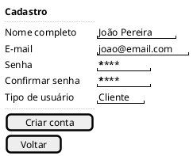

# Tela de Cadastro de Usuário

```plantuml
@startsalt
{
  <b>Cadastro
  ..

  Nome completo | "João Pereira"
  E-mail | "joao@email.com"
  Senha | "********"
  Confirmar senha | "********"
  Tipo de usuário | "Cliente"

  ..

  [ Criar conta ]
  [ Voltar ]
}
@endsalt
```
