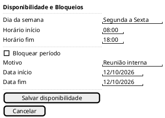

# Tela de Disponibilidade e Bloqueio

```plantuml
@startsalt
{
  <b>Disponibilidade e Bloqueios
  ..

  Dia da semana | "Segunda a Sexta"
  Horário início | "08:00"
  Horário fim | "18:00"

  ..

  [ ] Bloquear período
  Motivo | "Reunião interna"
  Data início | "12/10/2026"
  Data fim | "12/10/2026"

  ..

  [ Salvar disponibilidade ]
  [ Cancelar ]
}
@endsalt
```
