## Introdução

Mapa mental é uma técnica de representação visual que parte de um conceito central e se ramifica em ideias relacionadas, facilitando a organização do conteúdo e as associações entre as informações. Neste projeto, ele foi usado para consolidar em uma única visão o escopo levantado na pesquisa e no brainstorm.

## Metodologia

A partir da pesquisa do tema e dos requisitos elicitados no brainstorm, a equipe organizou as ideias em torno do conceito central da plataforma: usuários e seus papéis, tipos de profissionais, fluxo de agendamento, agenda e prevenção de conflitos, espaços e recursos, segurança e acesso, automação, gestão, além da separação entre o que faz parte do MVP e o que fica fora dele. O mapa foi escrito em PlantUML (arquivo <code>mapa_mental.puml</code>) e é renderizado automaticamente na documentação.

## Mapa mental - Plataforma de Agendamento Multidisciplinar

## Versão 1.0

```plantuml
@startmindmap
title Mapa Mental - Plataforma de Agendamento Multidisciplinar

* Plataforma de Agendamento Multidisciplinar
** Usuários
*** Cliente
**** Criar conta
**** Buscar profissionais
**** Agendar atendimento
**** Reagendar
**** Cancelar
**** Visualizar agenda
*** Profissional
**** Configurar disponibilidade
**** Bloquear horários
**** Visualizar agenda
**** Atender clientes recorrentes
*** Recepcionista
**** Consultar disponibilidade
**** Criar agendamentos
**** Reagendar atendimentos
**** Cancelar atendimentos
*** Administrador
**** Gerenciar usuários
**** Gerenciar profissionais
**** Gerenciar serviços
**** Gerenciar espaços
**** Gerenciar recursos
**** Gerenciar permissões

** Profissionais
*** Personal Trainer
*** Nutricionista
*** Fisioterapeuta
*** Outros profissionais de saúde e bem-estar

** Agendamento
*** Escolher serviço
*** Escolher profissional
*** Escolher local
*** Escolher data
*** Escolher horário
*** Confirmar
*** Reagendar
*** Cancelar
*** Recorrência
**** Semanal
**** Validação de cada ocorrência

** Agenda
*** Agenda do cliente
*** Agenda do profissional
*** Disponibilidade
*** Bloqueios
*** Status do atendimento
*** Prevenção de conflitos
**** Conflito do cliente
**** Conflito do profissional
**** Conflito de sala
**** Conflito de recurso

** Espaços e Recursos
*** Salas
*** Consultórios
*** Estúdios
*** Equipamentos
*** Recursos exclusivos
*** Controle de disponibilidade

** Segurança e Acesso
*** Login
*** Recuperação de senha
*** Perfis de usuário
*** Controle de privilégios
*** Privacidade
*** Proteção de dados
*** LGPD

** Automação
*** Lembretes
*** Confirmações
*** Avisos de cancelamento
*** Liberação de horário
*** Lista de espera
*** Aviso de nova vaga
*** Integração futura com calendário

** Gestão
*** Serviços
*** Profissionais
*** Clientes
*** Agenda
*** Espaços
*** Recursos
*** Permissões
*** Relatórios futuros

** MVP
*** Cadastro e autenticação
*** Perfis e papéis
*** Profissionais
*** Serviços
*** Disponibilidade
*** Agendamento
*** Reagendamento
*** Cancelamento
*** Agenda
*** Espaços e recursos
*** Validação de conflitos
*** Recorrência

** Fora do MVP
*** Prontuário clínico completo
*** Telemedicina
*** Diagnóstico
*** Prescrição por IA
*** Convênios
*** Pagamentos avançados
*** Aplicativo mobile nativo

@endmindmap
```

## Conclusão

O mapa mental deu à equipe uma visão geral do produto e evidenciou que o núcleo da solução é o agendamento com prevenção de conflitos entre cliente, profissional, sala e recurso. Também deixou clara a fronteira do MVP, separando funcionalidades clínicas e financeiras como evoluções futuras.

## Referências

> [Pesquisa do tema](./pesquisa.md)

> [Brainstorm](./Brainstorm.md)

> PlantUML - MindMap. Disponível em: https://plantuml.com/mindmap-diagram

## Versionamento

| Data | Versão | Descrição | Autor(es) |
| -- | -- | -- | -- |
| 08/09/2026 | 1.0 | Criação do mapa mental da plataforma em PlantUML | Miguel Figueira, Miguel Esteves e Kauê Fernandes |
