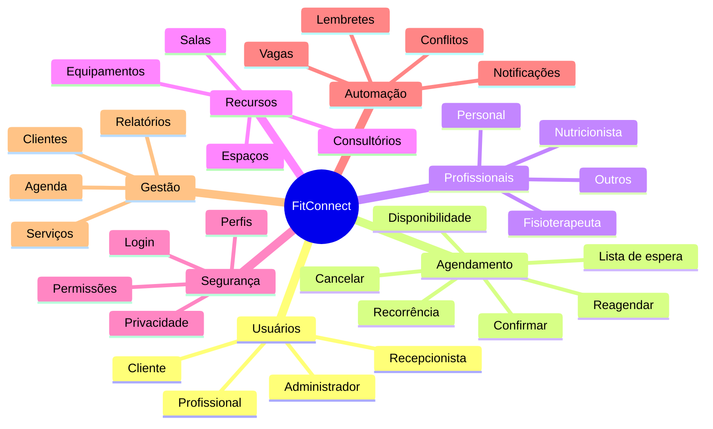
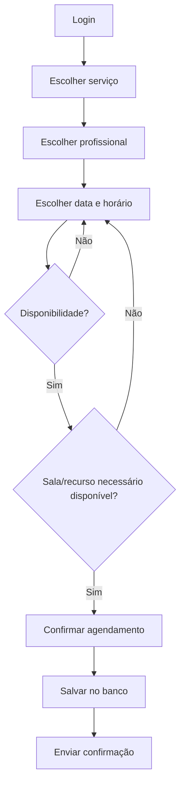

# Mapas Mentais

## Mapa mental principal

```mermaid
mindmap
  root((FitConnect))
    Usuários
      Cliente
      Profissional
      Recepcionista
      Administrador
    Agendamento
      Disponibilidade
      Confirmar
      Reagendar
      Cancelar
      Recorrência
      Lista de espera
    Profissionais
      Personal
      Nutricionista
      Fisioterapeuta
      Outros
    Recursos
      Salas
      Consultórios
      Equipamentos
      Espaços
    Segurança
      Login
      Perfis
      Permissões
      Privacidade
    Automação
      Lembretes
      Notificações
      Conflitos
      Vagas
    Gestão
      Serviços
      Clientes
      Agenda
      Relatórios
```

## Mapa de fluxo de agendamento

```mermaid
flowchart TD
    A[Login] --> B[Escolher serviço]
    B --> C[Escolher profissional]
    C --> D[Escolher data e horário]
    D --> E{Disponibilidade?}
    E -- Não --> D
    E -- Sim --> F{Sala/recurso necessário disponível?}
    F -- Não --> D
    F -- Sim --> G[Confirmar agendamento]
    G --> H[Salvar no banco]
    H --> I[Enviar confirmação]
```
